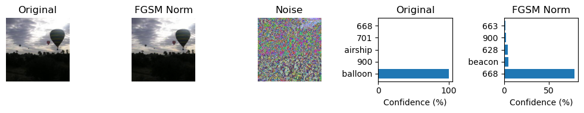
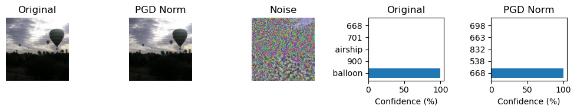

# Project 3. Image-Adversarial-Attack

## Team Members

Yukang Luo (yl13427@nyu.edu), Zhilin Zhang (zz10068@nyu.edu), Yumeng Qian (yq2480@nyu.edu).

## Attack Set Visualization on ResNet-34 Model

### FGSM ($\epsilon_{norm}$)

### FGSM ($\epsilon_{raw}$)

### PGD ($\epsilon_{norm}$)

### PGD ($\epsilon_{raw}$)

### Patch PGD ($\epsilon_{norm}$)

### Patch PGD ($\epsilon_{raw}$)
