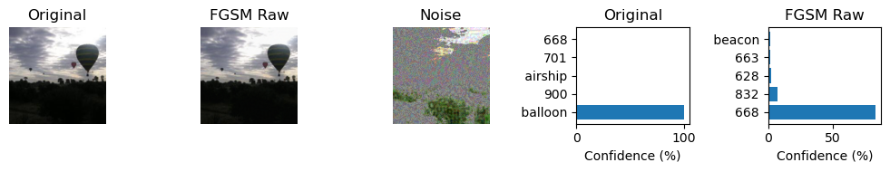
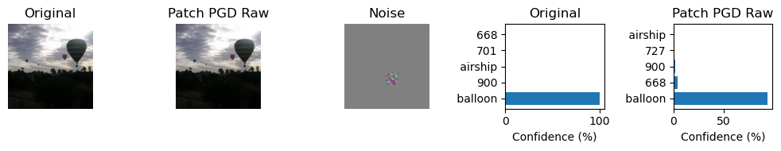

# Project 3. Image-Adversarial-Attack

## Team Members

Yukang Luo (yl13427@nyu.edu), Zhilin Zhang (zz10068@nyu.edu), Yumeng Qian (yq2480@nyu.edu).

## Results on Attack Sets

### Pre-trained Model: ResNet-34
| Dataset                     | Top-1 Accuracy      | Top-5 Accuracy      |
|-----------------------------|---------------------|---------------------|
| original                    | 76.00% (   0.00%) | 94.20% (   0.00%) |
| fgsm_norm                   |  7.80% ( -68.20%) | 38.00% ( -56.20%) |
| fgsm_raw                    |  7.60% ( -68.40%) | 38.00% ( -56.20%) |
| pgd_norm                    |  0.20% ( -75.80%) | 14.00% ( -80.20%) |
| pgd_raw                     |  0.20% ( -75.80%) | 14.20% ( -80.00%) |
| patch_pgd_norm              | 48.60% ( -27.40%) | 83.80% ( -10.40%) |
| patch_pgd_raw               | 48.20% ( -27.80%) | 80.60% ( -13.60%) |
| targeted_patch_pgd_norm     | 71.60% (  -4.40%) | 93.00% (  -1.20%) |
| targeted_patch_pgd_raw      | 73.00% (  -3.00%) | 93.40% (  -0.80%) |

### Pre-trained Model: ResNet-101
| Dataset                     | Top-1 Accuracy      | Top-5 Accuracy      |
|-----------------------------|---------------------|---------------------|
| original                    | 82.20% (   0.00%) | 97.60% (   0.00%) |
| fgsm_norm                   | 73.60% (  -8.60%) | 95.60% (  -2.00%) |
| fgsm_raw                    | 74.40% (  -7.80%) | 95.40% (  -2.20%) |
| pgd_norm                    | 73.00% (  -9.20%) | 94.80% (  -2.80%) |
| pgd_raw                     | 72.60% (  -9.60%) | 95.00% (  -2.60%) |
| patch_pgd_norm              | 79.60% (  -2.60%) | 97.00% (  -0.60%) |
| patch_pgd_raw               | 80.60% (  -1.60%) | 96.60% (  -1.00%) |
| targeted_patch_pgd_norm     | 82.00% (  -0.20%) | 97.60% (   0.00%) |
| targeted_patch_pgd_raw      | 81.60% (  -0.60%) | 97.40% (  -0.20%) |

### Pre-trained Model: DenseNet-121
| Dataset                     | Top-1 Accuracy      | Top-5 Accuracy      |
|-----------------------------|---------------------|---------------------|
| original                    | 75.60% (   0.00%) | 93.60% (   0.00%) |
| fgsm_norm                   | 64.40% ( -11.20%) | 89.20% (  -4.40%) |
| fgsm_raw                    | 64.60% ( -11.00%) | 89.00% (  -4.60%) |
| pgd_norm                    | 63.40% ( -12.20%) | 91.00% (  -2.60%) |
| pgd_raw                     | 63.00% ( -12.20%) | 90.60% (  -3.00%) |
| patch_pgd_norm              | 72.20% (  -3.40%) | 92.80% (  -0.80%) |
| patch_pgd_raw               | 73.80% (  -1.80%) | 92.60% (  -1.00%) |
| targeted_patch_pgd_norm     | 75.60% (   0.00%) | 92.80% (  -0.80%) |
| targeted_patch_pgd_raw      | 75.40% (  -0.20%) | 93.60% (   0.00%) |

## Attack Noise Visualization for ResNet-34 Model

### FGSM ($\epsilon_{norm}$)

### FGSM ($\epsilon_{raw}$)

### PGD ($\epsilon_{norm}$)

### PGD ($\epsilon_{raw}$)

### Patch PGD ($\epsilon_{norm}$)

### Patch PGD ($\epsilon_{raw}$)
